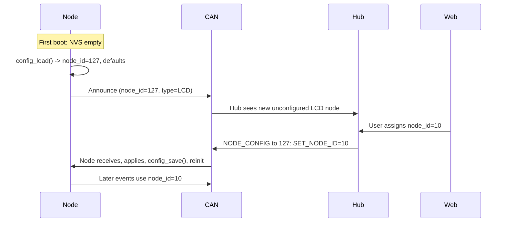

# Config Store Update: Default Node ID, NVS, and Hub-Driven Configuration

## Current state

- [config_store.cpp](src/common/config_store.cpp): Always returns in-RAM defaults (`node_id = 10`, 4 toggle inputs); no NVS. `config_save` is a no-op.
- [config_store.h](src/common/config_store.h): `node_config_t` has `node_id`, `input_count`, `inputs[16]`.
- [main.cpp](src/main.cpp): Loads config once in `setup()`, passes `cfg.node_id` to `input_engine_init`. No CAN RX for config messages. Node role is compile-time only (`NODE_ROLE_LCD` / `NODE_ROLE_MIN`).
- CAN today: only **input events** (node → hub). No message type for hub → node config or for node discovery/heartbeat.

## 1. Default node ID and "new node" detection

- **Reserved "unconfigured" node ID**: Use **127** (0x7F) so valid configured IDs stay in 1..126.
- In [config_store.cpp](src/common/config_store.cpp) (and NVS defaults): when there is no saved config, set `node_id = NODE_ID_UNCONFIGURED` (127).
- Define `NODE_ID_UNCONFIGURED` as 127 in the node (see section 5); hub firmware must use the same value when detecting or addressing unconfigured nodes.
- **Hub side (concept)**: Hub listens for traffic from node ID 127 and treats it as a new node; after assigning a real ID via config, the node will use that ID and no longer use 127.

## 2. Node type (LCD vs mechanical)

- **At runtime**: Expose node type as a constant or variable derived from build flags, e.g. `NODE_TYPE_LCD = 1`, `NODE_TYPE_MECHANICAL = 2`.
- **Discovery/heartbeat**: Node sends a periodic frame (or one-shot on boot) that includes: current node_id (so 127 when unconfigured), node type, and optionally firmware version or input_count. Hub uses this to show "new LCD node" vs "new mechanical node" and to drive the web UI.
- **Protocol placeholders**:  
  - New CAN **message type** from node → hub: e.g. `CAN_MSG_NODE_ANNOUNCE` or reuse/extend `HEARTBEAT` (0x8) with first data byte = node type.  
  - Same ID scheme as today: `(msg_type << 7) | node_id`, so when `node_id == 0x7F` the hub sees "unconfigured node" and can still decode type from payload.

No change to mechanical vs LCD build structure; only the payload of the announce/heartbeat message differs by type (or one byte encodes type).

## 3. config_store: NVS and first-download behavior

- **NVS namespace**: Use ESP32 `Preferences` (NVS) with a dedicated namespace, e.g. `"node_cfg"`, and a fixed key for the blob or a few keys for node_id, input_count, and input array.
- **config_load**:  
  - Try NVS read.  
  - If no key exists (first download / factory): return **defaults** with `node_id = NODE_ID_UNCONFIGURED`, `input_count` and `inputs[]` as appropriate: e.g. LCD default 4 inputs; **mechanical default 1 gang** (input_count = 1, one input with default mode).  
  - If NVS present: fill `node_config_t` from NVS and return.
- **config_save**: Write current `node_config_t` to NVS (blob or per-field). Return true/false on success. Called after the node applies a config message from the hub (and optionally on any local change).
- **Optional**: Add a "factory reset" helper that clears the NVS key and reboots (or just clears and leaves load to next boot). Useful for re-commissioning.

Files to touch: [config_store.h](src/common/config_store.h) (optional: add `NODE_ID_UNCONFIGURED` here for use in config_store only, or use the constant from can.h); [config_store.cpp](src/common/config_store.cpp) (NVS read/write, default `node_id = 127`).

## 4. Hub sends configuration "via web"

- **Flow**: User sets node_id (and optionally other options) in the hub's web UI → hub sends one or more CAN frames **to the node** (hub → node).
- **New CAN message type (hub → node)**: e.g. `CAN_MSG_NODE_CONFIG = 0x3` (or another free type). Identifier: `(CAN_MSG_NODE_CONFIG << 7) | target_node_id`, where `target_node_id` is either the current node id or **127** when addressing a not-yet-configured device.
- **Payload (minimal)**: At least one sub-command byte, then parameters.  
  - Example: `[ CMD_SET_NODE_ID, new_node_id ]` → node sets `cfg.node_id = new_node_id`, calls `config_save()`, then re-inits input engine (and any other subsystems) with the new id; optionally reboots to ensure a clean state.  
  - **Mechanical nodes**: The hub sends **switch type (momentary vs toggle) per input** via `CMD_SET_INPUT_CFG` (e.g. input_index, input_id, mode). Node stores it in `node_config_t.inputs[].mode` and uses it for event semantics. No global switch-type command.
  - **Find-me (locate node)**: New command so the hub can drive a **digital output** on the node (e.g. LED or GPIO) to help identify it on the network. E.g. `CMD_FIND_ME` or `CMD_SET_OUTPUT` with optional duration: node turns on the output for N seconds (or toggles it), so the installer can see which physical device corresponds to which node in the web UI. **Which output is used is a configurable output index stored in NVS** (per board or per install), not a fixed GPIO in code.
  - Further commands can extend the payload (see section 6).
- **Node RX path**: In [main.cpp](src/main.cpp) (or a small `can_config_rx` module), in the existing CAN read loop (e.g. where `handle_can_messages` runs):  
  - If `identifier` is `(CAN_MSG_NODE_CONFIG << 7) | self_node_id` (with `self_node_id` from `cfg.node_id` or from a variable updated after config_load), parse the payload and apply commands (SET_NODE_ID, SET_INPUT_CFG, SET_TIMING, CMD_FIND_ME, etc.), then `config_save()` and re-init where needed (find-me does not require re-init).  
  - Only accept config when `self_node_id == 127` (unconfigured) or when the message is addressed to the current configured id (so hub can re-configure later if desired).

This applies to both LCD and mechanical nodes: same CAN message type and same handling in shared code. Mechanical: switch type per input only; gang count 1–6 default 1; debounce/timing hub-configurable; find-me digital output command.

## 5. Where to define protocol constants

**Option B (chosen):** Define constants only in the node codebase. Add `NODE_ID_UNCONFIGURED = 127`, `CAN_MSG_NODE_ANNOUNCE`, `CAN_MSG_NODE_CONFIG`, and config sub-commands (e.g. `CMD_SET_NODE_ID`, `CMD_SET_INPUT_CFG`, `CMD_SET_INPUT_COUNT`, `CMD_SET_TIMING`, `CMD_FIND_ME`, `CMD_SET_FIND_ME_OUTPUT`) in [can.h](src/common/can.h). Document the protocol (message types, ID encoding, payload layout, and the value 127 for unconfigured) for hub implementers (e.g. in a README or protocol doc in the repo) so the hub can use the same values when building web → CAN messages.

## 6. Suggestions for other useful configuration (per node type)

**Common (both LCD and mechanical)**

- **node_id** (already above).  
- **Heartbeat/announce interval** (e.g. 0 = off, 1–255 = seconds) so hub can detect dead nodes.  
- **Input count** and **per-input mode** (momentary vs toggle): already in `node_config_t`; hub can send a "set input config" command (e.g. `CMD_SET_INPUT_CFG`, input_index, input_id, mode) and node updates `cfg.inputs[]` and saves.

**LCD-specific**

- **Default backlight level** or timeout (if you add backlight control).  
- **Number of "buttons" (input_count)** and labels (if you later store labels in NVS; start with count/mode only).  
- **Optional**: default screen or theme (if you have multiple screens).

**Mechanical-specific**

- **Switch type (momentary vs toggle)**: **Per input only** — hub sends via `CMD_SET_INPUT_CFG` (input_index, input_id, mode); no global switch-type command.
- **Number of switches (gang)**: **Configurable 1–6, default 1.** Hub sends actual count (e.g. `CMD_SET_INPUT_COUNT`, count 1..6). Node enables only that many inputs; one firmware serves 1- to 6-gang hardware. Default 1 when no NVS/config.
- **Debounce / timing**: **Compile-time defaults**, but **configurable by hub**. Node has default values (e.g. click max duration, double-click gap, hold min, long-hold min) in code; hub can send a command (e.g. `CMD_SET_TIMING` with bytes or words for each value) to override and persist in NVS so timing is applied on next boot and in runtime if the input engine reads from config.
- **Find-me (locate node)**: **New web-to-node command** to set a **digital output** so the installer can find the node on the network. E.g. `CMD_FIND_ME` with optional duration byte: node drives the configured output for N seconds, then releases. **The output is identified by a configurable output index stored in NVS** (hub or node can set it via config; each board/install may use a different physical GPIO or LED). Does not require `config_save` or re-init for the find-me action itself; effect is immediate and transient. Adding or changing the output index in NVS is a separate config write (e.g. `CMD_SET_FIND_ME_OUTPUT`, output_index).

Implement in this order: (1) NVS + default `node_id = NODE_ID_UNCONFIGURED`, (2) CAN config RX and `CMD_SET_NODE_ID` with `config_save` and re-init, (3) node announce/heartbeat with node type, (4) per-input `CMD_SET_INPUT_CFG`, gang count 1–6 default 1, `CMD_SET_TIMING`, and `CMD_FIND_ME` (digital output to locate node); document or implement LCD-specific options as needed.

## Summary diagram

## Implementation order (todos)

1. **config_store NVS and default node ID**: Add `NODE_ID_UNCONFIGURED`; implement NVS in `config_load`/`config_save`; use default `node_id = NODE_ID_UNCONFIGURED` when no NVS data.
2. **CAN protocol constants**: Add `CAN_MSG_NODE_CONFIG` (and optionally `CAN_MSG_NODE_ANNOUNCE`/heartbeat type), `CMD_SET_NODE_ID`, `CMD_SET_INPUT_CFG`, `CMD_SET_INPUT_COUNT`, `CMD_SET_TIMING`, `CMD_FIND_ME`, `CMD_SET_FIND_ME_OUTPUT` in [can.h](src/common/can.h); add `NODE_ID_UNCONFIGURED = 127`. Document protocol for hub (see section 5).
3. **Config RX in main**: In CAN read loop, handle `CAN_MSG_NODE_CONFIG` addressed to this node; on `CMD_SET_NODE_ID`, update cfg, call `config_save()`, re-init input_engine (and use new node_id for subsequent CAN TX). Handle `CMD_FIND_ME` to drive digital output (no save/reinit).
4. **Node announce/heartbeat**: Periodic or one-shot CAN frame with node_id (127 if unconfigured), node type (LCD/mechanical), optionally input_count; hub can use this to detect and list new nodes.
5. **Mechanical config**: Implement `CMD_SET_INPUT_CFG` (per-input momentary/toggle), `CMD_SET_INPUT_COUNT` (1–6, default 1), `CMD_SET_TIMING` (debounce/timing overrides with compile-time defaults); implement `CMD_FIND_ME` (digital output to locate node) and `CMD_SET_FIND_ME_OUTPUT` (set find-me output index in NVS). Store find-me output index in NVS. Ensure config_store and input_engine support 1–6 inputs and timing from config.
